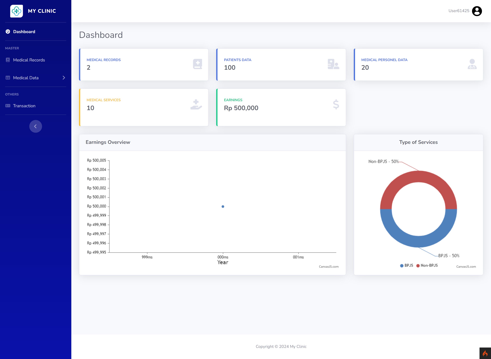

# Clinic Website

Selamat datang di proyek **Clinic Website**! 🎉 Proyek ini dibangun menggunakan CodeIgniter 4, proyek ini merupakan tugas mata kuliah Rekayasa Perangkat Lunak dengan studi kasus **Pelayanan Administrasi Klinik**. Aplikasi ini memanfaatkan template dashboard **SB Admin 2** dan **Myth-Auth** untuk fitur login dan register.

## 🖥️ Screenshot



## ✨ Fitur

1. **Manage Data Pasien.**
2. **Manage Data Tenaga Medis.**
3. **Manage Data Layanan.**
4. **Manage Data Jenis Pelayanan (BPJS/Non-BPJS).**
5. **Manage Data Rekam Medis.**
6. **Cetak Transaksi.**
7. **Cetak Laporan.**

## 🚀 Teknologi yang Digunakan

-  **CodeIgniter 4.4**: Framework PHP untuk membangun aplikasi web.
- **SB Admin 2**: Template dashboard responsif dan komponen UI base on **Boostrap 4**.

## 📦 Instalasi

1. **Clone Repository**:
    ```bash
    git clone https://github.com/alfian742/clinic-website.git
    ```

2. **Masuk ke Direktori Proyek**:
    ```bash
    cd clinic_website
    ```

3. **Update Dependensi**:
    ```bash
    composer update
    ```

4. **Konfigurasi ENV**:
    - Ubah nama `.env.example` menjadi `.env`.
    - Lakukan konfigurasi sesuai kebutuhan.

5. **Konfigurasi ENV**:
   - Buat database sesuai dengan konfigurasi ENV.

7. **Migrate Database dan Seeder**:
    ```bash
    php spark migrate
    ```

   ```bash
    php spark migrate -all 
    ```

   ```bash
    php spark db:seed DatabaseSeeder
    ```

8. **Jalankan Aplikasi**:
    ```bash
    php spark serve
    ```
    - Akses aplikasi di browser melalui URL: `http://localhost:8080`.

## 📖 Panduan Penggunaan

1. **Register**:
   - Buat akun baru dengan menggunakan fitur register.

2. **Login**:
   - Masukkan kredensial login setelah registrasi.

3. **CRUD Operasi**:
   - **Create**: Tambahkan data baru melalui form input.
   - **Read**: Lihat daftar data dengan fitur pencarian dan pagination.
   - **Update**: Edit data dengan memilih opsi edit pada halaman tabel.
   - **Delete**: Hapus data dengan memilih opsi hapus pada halaman tabel.

4. **Konfigurasi Login/Register (Opsional)**:
   - Konfigurasi dapat dilakukan pada direktori `vendor/myth/auth/src`.

---

Terima kasih telah mengunjungi repositori ini! Jika ada pertanyaan atau saran, jangan ragu untuk menghubungi saya.
